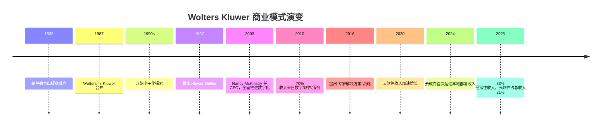
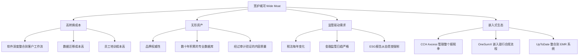

# WTKWY Wolters Kluwer 商业模式深度分析

> 数据来源：Morningstar 量化研究报告（2026年3月5日）+ 公开资料综合研究

---

## 一、公司概览

| 项目 | 内容 |
|------|------|
| **公司全称** | Wolters Kluwer N.V. |
| **成立时间** | 1836年（荷兰） |
| **总部** | 荷兰 Alphen aan den Rijn |
| **上市交易所** | 阿姆斯特丹泛欧交易所 (AEX: WKL)；美国 OTC 市场 (WTKWY) |
| **市值** | ≈ $178.5 亿美元（截至2026年3月） |
| **员工数** | 约 21,000 人 |
| **CEO** | Stacey Caywood（2026年2月27日正式接任；前任 Nancy McKinstry 执掌23年，主导数字化转型） |
| **行业分类** | 专业信息服务 / 特种商业服务 |

**一句话定义：** Wolters Kluwer 是一家向全球专业人士（医生、律师、会计师、金融合规人员）出售 **"不能出错的信息与工具"** 的公司。

---

## 二、历史演变：从印刷出版商到 SaaS 软件公司



> [!IMPORTANT]
> **核心转型逻辑**：Wolters Kluwer 用了 **20多年** 完成了从"卖书/卖出版物"到"卖软件订阅+嵌入式工作流工具"的根本性转变。这不是简单的"数字化"，而是将 **专业知识 + 软件工具 + 工作流自动化** 三者深度融合。

---

## 三、五大业务部门详解

Wolters Kluwer 按终端客户行业划分为 **五大业务部门**：

### 1. 🏥 Health（医疗健康）—— 实际占收入 26%（FY2025：€1,596M，利润率32.1%）

**核心逻辑：** 为医生、护士、医院提供"不能出错"的临床决策支持工具。

| 核心产品 | 描述 | 市场地位 |
|---------|------|---------|
| **UpToDate** | 循证医学临床决策支持系统 | 覆盖美国 88% 教学医院，全球 300+ 万医护人员使用，KLAS排名 #1 |
| **Ovid** | 学术医学文献数据库 | 覆盖 120+ 出版商，100+ 医学专业领域 |
| **Lexidrug** (原 Lexicomp) | 药物信息数据库 | 医院药房标配工具 |
| **Medi-Span** | 嵌入式药物数据解决方案 | 整合进 EMR/EHR 系统 |
| **Lippincott** | 护理程序/临床指南/医学期刊 | 美国 CDS 市场份额 #1 |

**生意本质：** 医生在临床决策时查阅 UpToDate，就像律师查阅法律条文、会计师查阅税法一样 —— **这是一种"责任免除盾牌"**。如果医生按照 UpToDate 的指导治疗但出了问题，可以证明自己遵循了循证标准；但如果没有查阅而出了差错，则面临医疗诉讼风险。这使得 UpToDate 的续约率极高。

> [!NOTE]
> UpToDate 超过 80% 的收入来自机构客户（医院、医疗系统），且 92% 的用户信任其作为临床资源，85% 会推荐给同事。

---

### 2. 📊 Tax & Accounting（税务与会计）—— 实际占收入 27%（FY2025：€1,660M，利润率35.2%，集团最高）

**核心逻辑：** 为会计师事务所和企业税务部门提供从报税到审计的全流程软件工具。

| 核心产品 | 描述 | 市场地位 |
|---------|------|---------|
| **CCH Axcess** | 云端一体化税务/审计/事务所管理平台 | *Accounting Today* Top 100 事务所中 94 家使用 |
| **CCH ProSystem fx** | 本地部署的税务会计软件套件 | 大型事务所传统标配 |
| **CCH AnswerConnect** | 税法问答与研究工具 | 税务专业人员必备参考源 |
| **TaxWise / ATX** | 中小型报税软件 | 面向独立报税人和小型事务所 |
| **U.S. Master Tax Guide** | 美国税务年度参考指南 | 行业经典参考书（已数字化） |

**生意本质：** 美国税法极其复杂且每年变化，**税务软件是"必须品"而非"可选品"**。一旦会计师事务所将 CCH Axcess 整合到日常工作流（客户资料管理、报税流程、审计文档），切换成本极高——需要重新培训员工、迁移数据、重新配置流程。这形成了极强的 **"锁定效应"**。

> [!TIP]
> CCH Axcess 云软件在 2025 年实现了 19% 的有机增长，是公司增长最快的产品线之一。

---

### 3. 🏦 Financial & Corporate Compliance（金融与企业合规）—— 实际占收入 20%（FY2025：€1,239M，利润率35.2%）

**核心逻辑：** 帮助银行、保险公司、企业应对日益复杂的金融监管合规要求。

| 核心产品 | 描述 | 市场地位 |
|---------|------|---------|
| ~~**OneSumX**~~ | ~~整合式监管合规与风险管理平台~~ | ⚠️ **已于2025年11月30日以$5.26亿出售给 Regnology（监管科技公司），不再属于WK** |
| **CT Corporation** | 注册代理服务 / 企业合规管理 | 美国最大的注册代理服务商之一 |
| **Lien Solutions** | 留置权管理解决方案 | 贷款合规领域领先 |
| **eOriginal** | 数字资产管理 | 电子贷款/数字票据管理 |
| **ComplianceOne** | 合规智能平台 | 亚太地区合规解决方案 |

> [!WARNING]
> **OneSumX 剥离（2025年11月30日）**：WK 已完成将银行金融风险监管报告（FRR）业务出售给 Regnology，成交价约 $5.26亿。这是 WK 主动聚焦"专业信息软件"核心赛道的战略性瘦身。2026年起 Financial & Corporate Compliance 板块营收将重述缩减，需等待新口径披露。

**生意本质：** 金融行业面临极度严格的监管（巴塞尔协议、反洗钱、KYC等），**不合规的代价可能是天价罚款甚至牌照吊销**。Wolters Kluwer 的解决方案帮助金融机构自动化合规流程，减少人为错误和监管处罚风险。监管越复杂，需求越大。

---

### 4. ⚖️ Legal & Regulatory（法律与监管）—— 实际占收入 16%（FY2025：€1,005M，利润率18.2%，集团最低）

**核心逻辑：** 为律师事务所、企业法务部门和政府机构提供法律研究和管理工具。

| 核心产品 | 描述 | 市场地位 |
|---------|------|---------|
| **VitalLaw** | 法律研究数据库 | 与 LexisNexis、Westlaw 竞争 |
| **Legisway** | 企业法务管理软件 | 欧洲市场领先 |
| **Kluwer Arbitration** | 国际仲裁信息平台 | 国际仲裁领域权威来源 |
| **Enterprise Legal Management** | 法律支出与事务管理 | 企业法务数字化转型工具 |

**生意本质：** 法律信息具有极强的"地域性"和"时效性"。每个国家、每个行业的法规都不同，且不断更新。Wolters Kluwer 的数据库持续维护和更新这些信息，律师依赖这些工具进行法律研究和合规分析。

---

### 5. 📈 Corporate Performance & ESG（企业绩效与ESG）—— 实际占收入 10%（FY2025：€625M，利润率7.5%，SaaS化转型期承压）

**核心逻辑：** 帮助企业 CFO 进行财务规划、合并报表、监管报告和 ESG 报告。

| 核心产品 | 描述 | 市场地位 |
|---------|------|---------|
| **CCH Tagetik** | AI驱动的企业绩效管理 (CPM) 软件 | 与 SAP BPC、OneStream、Anaplan 竞争 |
| **Enablon** | EHS & ESG管理软件 | 中大型企业广泛采用 |
| **TeamMate** | 内部审计管理解决方案 | 内审领域领先品牌 |

**生意本质：** ESG 报告从"自愿披露"变成"强制合规"（如欧盟 CSRD 指令），创造了巨大的新增需求。CCH Tagetik 整合了传统财务规划与合规报告功能，成为企业 CFO 办公室的核心工具。

---

## 四、收入结构分析 —— "印钞机"模式

### FY2025 各板块实际财务数据（2026年2月25日年报披露）

| 业务板块 | 营收（€M） | 占总收入% | 有机增长 | 调整后营业利润（€M） | 利润率 | 战略定位 |
|---------|----------|---------|--------|-----------------|------|---------|
| **Tax & Accounting** | **1,660** | **27.1%** | **+7%** | **584** | **35.2%** | 利润奶牛：营收最大+利润率最高+增速并列最快 |
| **Health** | **1,596** | **26.1%** | **+5%** | **512** | **32.1%** | 核心品牌：UpToDate全球护城河，AI竞争压力上升 |
| **Fin. & Corp. Compliance** | **1,239** | **20.2%** | **+3%** | **437** | **35.2%** | 稳定器：增速最慢但利润率与Tax并列最高；OneSumX已剥离，2026口径变化 |
| **Legal & Regulatory** | **1,005** | **16.4%** | **+5%** | **183** | **18.2%** | 最脆弱：利润率垫底，AI竞争最激烈（Harvey+Anthropic+LexisNexis三线夹击） |
| **Corp. Performance & ESG** | **625** | **10.2%** | **+7%** | **48** | **7.5%** | 高成长低利润：增速并列最快，但利润从€61M降至€48M（-21%），SaaS化过渡期阵痛 |
| 公司总部（成本中心） | — | — | — | -77 | — | — |
| **集团合计** | **6,125** | **100%** | **+6%** | **1,687** | **27.5%** | — |

> [!NOTE]
> **三个关键不匹配**：
> - Legal（16%营收）× 利润率最低（18.2%）× AI竞争最激烈 → 一旦增速放缓，EPS 冲击被杠杆放大
> - Corp. Performance & ESG（增速+7%，与Tax并列）× 利润率最低（7.5%，且同比从10%大幅压缩）→ 成长性好但正经历许可证向SaaS的痛苦过渡
> - Tax & Accounting 是真正的"命脉"：三项指标均排名第一，最值得守护

### 按收入类型划分（2024财年）

```
┌──────────────────────────────────────────────────────────────────┐
│                    总收入 €5,916M                                 │
├────────────────────────────────────────┬─────────────────────────┤
│        经常性收入 82% (€4,868M)         │  非经常性收入 18%        │
│  ┌─────────────────────────────────┐   │  ┌──────────────────┐  │
│  │ 数字订阅 €4,458M (+8% 有机增长)  │   │  │ 交易收入 €436M    │  │
│  │ 印刷订阅 €125M (持续下降)        │   │  │ 印刷书籍 €120M    │  │
│  │ 其他经常性 €285M                 │   │  │ 其他 €492M        │  │
│  └─────────────────────────────────┘   │  └──────────────────┘  │
└────────────────────────────────────────┴─────────────────────────┘
```

### 按解决方案类型划分

| 类型 | 占总收入比 | 有机增长率 |
|------|-----------|-----------|
| **专家解决方案** (软件产品 + 高级信息) | 59% | +7% |
| 其中：软件产品 | 45% | — |
| 其中：云软件 | 19% → 21% (2025) | **+16% (2024) / +15% (2025)** |
| 信息服务 | ~30% | — |
| 印刷 | ~4% | 持续下降 |

### 按地区划分

| 地区 | 占比 |
|------|------|
| **北美（美国+加拿大）** | ~64% |
| **欧洲** | ~30% |
| **亚太及其他** | ~6% |

> [!IMPORTANT]
> **关键洞察：82-83% 的经常性收入 + 数字订阅持续增长 = 极高的收入可预测性和可见性。** 这意味着即使经济衰退，大部分收入也不会消失（医生不会停止使用 UpToDate，会计师不会在报税季放弃 CCH Axcess）。

---

## 五、竞争护城河分析

Morningstar 给予 Wolters Kluwer **"Wide Moat"（宽护城河）** 评级，概率常年维持在 0.99-1.00 区间。

### 护城河来源



### 1. 高转换成本（最核心的护城河）

这是 Wolters Kluwer 最强大的护城河来源。具体表现为：

- **工作流锁定：** CCH Axcess 不仅是报税软件，而是管理整个会计师事务所日常运营的平台。切换意味着要重建整个工作流程。
- **数据锁定：** 积累了多年的客户数据、历史报税记录、审计文档都在系统中。迁移这些数据既困难又有丢失风险。
- **人员锁定：** 员工已经习惯使用特定工具，重新学习新系统有巨大的时间和培训成本。
- **风险锁定：** 专业领域（特别是医疗、法律、税务）的信息错误可能导致严重后果（诉讼、罚款）。在这种高风险环境下，客户倾向于选择已经验证的工具，而不是冒险尝试新产品。

### 2. 无形资产：专业内容的权威性

- UpToDate 的内容由全球顶级医学专家编写和审核，这种**知识壁垒**几乎不可能被快速复制。
- CCH 的税法研究数据库覆盖了数十年的税法变更、法院判例和 IRS 指导意见。
- 在专业人士的心目中，**Wolters Kluwer 的内容 = 真相的"唯一定义来源"（Single Source of Truth）**。

### 3. 监管复杂性驱动的持续需求

- 全球监管环境只会更复杂，不会更简单。
- 每一项新法规（如 OECD BEPS Pillar 2 国际税改、欧盟 CSRD ESG报告指令、不断更新的反洗钱规则）都为 Wolters Kluwer 创造新的产品和收入机会。
- **监管是 Wolters Kluwer 的"免费销售员"。**

---

## 六、财务表现关键指标（Morningstar 报告数据）

### 收入与盈利持续增长

| 指标 | 2016 | 2018 | 2020 | 2022 | 2024 | TTM 12/2025 |
|------|------|------|------|------|------|------------|
| 收入 (€Bil) | 4.30 | 4.26 | 4.60 | 5.45 | 5.92 | **6.13** |
| 营业利润 (€Bil) | 0.77 | 0.82 | 0.98 | 1.26 | 1.45 | **1.53** |
| 营业利润率 | 17.9% | 19.3% | 21.3% | 23.2% | 24.6% | **25.0%** |
| 净利润 (€Bil) | 0.49 | 0.66 | 0.72 | 1.03 | 1.08 | **1.31** |
| 自由现金流 (€Bil) | 0.66 | 0.69 | 0.92 | 1.11 | 1.26 | **1.26** |

### 资本回报率持续攀升

| 指标 | 2016 | 2018 | 2020 | 2022 | 2024 | TTM |
|------|------|------|------|------|------|-----|
| ROA | 5.8% | 7.8% | 8.4% | 11.1% | 11.6% | **13.7%** |
| ROE | 19.2% | 28.6% | 32.3% | 43.5% | 65.5% | **111.7%** |
| ROIC | 10.6% | 13.4% | 14.4% | 18.4% | 20.1% | **23.2%** |

> [!NOTE]
> ROE 异常高（111.7%）是因为公司通过持续回购减少了股本，净资产已经较低。ROIC 从 10.6% 增长到 23.2% 更能反映真实的资本效率提升。

### 持续回购 + 分红

| 指标 | 2016 | 2018 | 2020 | 2022 | 2024 | 当前 |
|------|------|------|------|------|------|------|
| 每股股息 | $0.78 | $0.97 | $1.27 | $1.58 | $2.21 | **$2.82** |
| 股息收益率 | 2.38% | 1.98% | 1.69% | 1.62% | 1.46% | **3.56%** |
| 回购收益率 | 0.76% | 3.14% | 2.08% | 2.22% | 3.01% | **6.98%** |
| 流通股 (Mil) | 287.7 | 271.2 | 262.4 | 248.7 | 234.4 | **226.2** |

**流通股从 2016 年的 2.88 亿股减少到 2025 年的 2.26 亿股，减少了约 21.5%。**

---

## 七、商业模式的核心本质 —— 用一个比喻来理解

> **Wolters Kluwer 本质上是"专业人士的操作系统"。**

想象一下：
- 医生需要做临床决策 → 打开 **UpToDate**
- 会计师需要报税 → 打开 **CCH Axcess**
- 银行合规官需要提交监管报告 → 打开 **OneSumX**
- CFO需要做财务规划和ESG报告 → 打开 **CCH Tagetik**
- 律师需要研究法律条文 → 打开 **VitalLaw**

这些专业人士 **每天、反复地** 使用这些工具完成核心工作。就像普通人离不开 Microsoft Office 一样，医生离不开 UpToDate，会计师离不开 CCH。

**这不是可选消费，而是"专业生存必需品"。**

---

## 八、与同类公司比较

| 公司 | 主要领域 | 商业模式相似度 | 差异 |
|------|---------|-------------|------|
| **RELX (Reed Elsevier)** | 科学/法律/风险分析 | ★★★★★ | RELX 更偏学术和风险数据 |
| **Verisk Analytics** | 保险/金融数据 | ★★★★☆ | Verisk 聚焦保险行业 |
| **Thomson Reuters** | 法律/税务/新闻 | ★★★★★ | 直接竞争对手，尤其在法律和税务领域 |
| **MSCI** | ESG评级/指数 | ★★★☆☆ | MSCI 偏金融市场指数 |
| **Intuit** | 消费者/中小企业税务 | ★★★☆☆ | Intuit 面向消费者，WK 面向专业人士 |

> [!TIP]
> Wolters Kluwer 与 Thomson Reuters、RELX 一起被称为"信息服务三巨头"。它们的共同特点是：**卖"必须品"信息，客户不对价格敏感，续约率极高。**

---

## 九、潜在风险与挑战

### AI颠覆风险（最大的不确定性）

- **挑战：** AI 工具（如大语言模型）可能减少对初级法律和会计专业人员的需求，从而压缩传统"按人头/按席位"收费模式的市场空间。
- **公司应对：** WK 已构建统一 AI 平台 **FAB（Foundation & Beyond，基础与超越）**，Expert AI 品牌贯穿全部产品线（UpToDate Expert AI / CCH Axcess Expert AI / VitalLaw Expert AI / CCH Tagetik Expert AI），2025年11月还以€9000万收购法律AI初创公司 Libra Technology GmbH。关键问题是：**能否成功从"人类席位订阅"转向"AI工作流平台计费"？**
- **竞争威胁的具体量化（截至2026年3月）**：

| 对手 | 产品 | 规模/最新进展 | 冲击的WK板块 |
|------|------|------------|------------|
| **OpenEvidence** | 临床AI问答 | 单日100万次医生咨询（2026年3月10日）；估值$120亿；美国大多数执业医生日常使用 | Health / UpToDate |
| **Thomson Reuters** | CoCounsel | 100万用户；"人类水平"税表自动生成（Ready to Review）；法律+税务全覆盖 | Legal & Tax 双线 |
| **Harvey AI** | 法律AI | 估值$110亿（7个月内3x）；ARR $1.95亿（+290%）；Am Law 100中50%采用 | Legal / VitalLaw |
| **LexisNexis** | Protégé（AI法律助手） | 四智能体架构；300+工作流；2026年2月全球发布 | Legal / VitalLaw |
| **Anthropic** | Claude 法律插件 | 2026年2月3日直接发布应用层法律工具，绕过软件商 | Legal（量级5冲击） |

- **深层分析：** AI 对 WK 是 **"双刃剑"**——若 AI 让信息获取更容易，将削弱内容护城河；但若 AI 增加专业合规复杂性（AI内容法律责任、监管要求验证），反而强化 WK 作为"权威验证来源"的价值。最大隐患在 **法律板块**（利润率18.2%，本就最薄，AI竞争最猛）和 **医疗板块**（OpenEvidence免费+原生AI正在改变医生查询习惯）。

### 估值陷阱风险

- Morningstar 报告指出，虽然当前股价（$79.20）相比公允价值估计（$149.56）有 47% 折让，但 **不确定性评级为"High"**，并已将评级限制在 3 星。
- 过去一年股价下跌约 35.6%，需要判断这是"机会"还是"价值陷阱"。

### 印刷收入持续下降

- 印刷订阅和书籍收入持续萎缩，但目前占比已很小（不到 5%），影响有限。

### 欧洲地缘政治 / 汇率风险

- 公司以欧元报告，但 64% 收入来自北美，存在汇率波动影响。

---

## 十、投资视角总结

### 支持投资的理由

1. **"必须品"生意：** 客户不是"想用"而是"不得不用"——法规要求、职业责任要求
2. **极高的经常性收入（83%）：** 收入可预测性强，抗经济周期
3. **宽护城河（Wide Moat）：** 高转换成本 + 内容权威性 + 监管驱动需求
4. **持续的利润率扩张：** 营业利润率从 17.9%（2016）提升到 25%（2025）
5. **慷慨的股东回报：** 回购+分红的总回报率当前超过 10%
6. **云软件转型成功：** 云收入 15-16% 年增长，SaaS 转型正在加速

### 需要关注的问题

1. **AI 对传统"按席位"商业模式的冲击程度**
2. **高负债率（当前比率仅 0.6）带来的财务灵活性限制**
3. **股价大幅下跌后是价值回归还是基本面恶化的信号**
4. **竞争对手（尤其是 Thomson Reuters）的技术追赶**

---

*最后更新：2026年3月18日 | 基于 Morningstar 量化报告 + WK 2025年全年报告（2026年2月25日）+ 公开资料研究*
