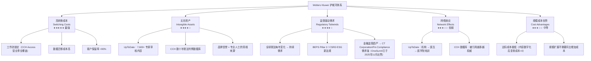

# Wolters Kluwer 护城河与竞争优势深度分析

> 数据来源：Morningstar 量化报告（2026年3月5日）+ 公开资料综合研究
>
> ⚠️ **重要背景**：本份 Morningstar 报告发布于 2026年3月5日，正是 Morningstar 分析师 Rob Hales 将 WK 护城河从 **宽（Wide）降级为窄（Narrow）** 的同一天。这是近一年股价大跌 35%+ 的核心原因。本报告将深度解析这一争议。

---

## 一、护城河全景图



---

## 二、护城河来源一：高转换成本（最核心）

### 本质理解

Wolters Kluwer 的转换成本不是那种"买了软件不好用不想换"。它的转换成本来自于 **可量化的职业风险**：

> 一个会计师事务所如果在报税季中途切换软件，可能导致客户数据丢失、报税延误、申报错误，进而面临客户诉讼、税务处罚，甚至损失多年积累的专业声誉。

**这不是不方便，而是不敢换。**

### 具体机制：以各业务部门为例

#### 🏥 Medical / UpToDate 的锁定机制

| 锁定层次 | 具体表现 |
|---------|---------|
| **机构合同锁定** | 医院与 UpToDate 签署多年期机构合同，覆盖全院所有医生 |
| **临床流程嵌入** | UpToDate 通过 API 直接嵌入 Epic、Cerner 等电子病历系统（EMR） |
| **教育体系绑定** | 医学院、住院医师培训默认使用 UpToDate；医生从第一天起就建立使用习惯 |
| **责任盾牌效应** | 医生按 UpToDate 指南治疗 → 若出问题可证明遵循循证标准；不用则面临医疗诉讼风险 |
| **数据积累** | 机构内的用药记录、临床指南跟踪历史都在 WK 平台上 |

**量化证据：**
- 全球 300+ 万医护人员使用 UpToDate
- 覆盖美国 **88%** 教学医院
- 100+ 项研究证实 UpToDate 与降低患者住院天数、减少并发症、降低死亡率正相关
- 客户续约率 **>90%**（公司披露数据）

#### 📊 Tax & Accounting / CCH Axcess 的锁定机制

| 锁定层次 | 具体表现 |
|---------|---------|
| **工作流全覆盖** | CCH Axcess 不只是报税工具，还管理客户档案、审计文档、事务所日常运营 |
| **时间节点锁定** | 税务季（1月-4月）期间，任何软件切换都是"自杀行为"，因此只能在税务季结束后考虑切换 |
| **切换的摩擦成本** | 需要重新培训所有税务人员（= 停工时间 + 培训费用）+ 历史数据迁移（风险极高） |
| **客户隐性成本** | 如果切换导致报税错误，不只是事务所损失，更是客户的税务处罚和审计风险 |
| **生态系统绑定** | CCH Axcess 与 ADP、QuickBooks 等系统深度集成，切换会破坏整个数据流 |

**量化证据：**
- *Accounting Today* Top 100 会计师事务所中 **94 家**使用 CCH Axcess
- CCH Axcess 2025 年云版本有机收入增长 **19%**
- CCH Axcess 在税务软件市场占有率约 **58.92%**（远超 Thomson Reuters UltraTax CS 的 2.53%）

#### 🏦 Financial Compliance / CT Corporation 的锁定机制

> ⚠️ **重要更新**：OneSumX FRR（金融风险监管报告）业务已于 **2025年11月30日** 正式出售给 Regnology，成交价约 $5.26亿。以下描述的是仍属于 WK 的 Financial & Corporate Compliance 板块核心业务（CT Corporation 注册代理、Lien Solutions 等）。

- CT Corporation 是美国最大注册代理服务商之一，处理企业注册、法律文件服务，深度嵌入公司合规生命周期
- 企业一旦使用 CT Corporation 的注册代理服务，更换意味着重新办理各州注册手续、法律文件重新授权，摩擦成本极高
- 监管报告失误的代价：天价罚款 + 监管声誉受损，客户不敢轻易切换
- 该板块 FY2025 利润率高达 **35.2%**，与 Tax & Accounting 并列集团最高，是高质量稳定业务的财务证据

---

## 三、护城河来源二：无形资产——"真相垄断"

### 概念框架：内容提供者 vs. 真相拥有者

> 普通内容公司 = Content Creator（内容创造者）→ 有替代品
>
> Wolters Kluwer = **Truth Owner（真相拥有者）** → 专业人士将其内容视为权威裁定标准

这一区别在有法律责任的专业场景中极其关键：

- 一个律师如果引用了不正确的法律条文，就面临渎职诉讼
- 一个医生如果使用了未经验证的医疗信息，就面临医疗过失风险
- 一个会计师如果使用了错误的税法解释，就面临税务欺诈指控

**在这种环境中，客户选择信息源不是看价格，而是看谁最权威、最可信赖。**

### UpToDate 的内容护城河（量化）

| 内容属性 | 规模 |
|---------|------|
| 涵盖医学专科数 | 25个专科 |
| 临床主题总数 | 12,800+ 个 |
| 参考文献与引用数 | 550,000+ 条 |
| 专家编辑与审核团队 | 7,600+ 名顶级临床医生 / 编辑 / 审核员 |
| 内容更新频率 | 每年更新 10,000+ 次，实时整合 100+ 临床期刊 |
| 独立研究验证 | 100+ 项同行评审研究证实其与改善患者预后相关 |

这 7,600 名专家不是 WK 的员工，而是全球各领域的权威医学专家。他们自愿参与是因为 UpToDate 是他们专业领域最权威的平台——这形成了一种 **正向飞轮**：权威越高 → 吸引到更权威的专家 → 内容质量越高 → 更权威。

### CCH 税务数据库的内容护城河

- 覆盖数十年的美国联邦税法、各州税法变更
- 整合 IRS 裁定（Revenue Rulings）、私信裁定（PLR）、联邦法院税务判例
- CCH AnswerConnect 让税务专业人员在复杂情境下可即时查询以"权威文件"支撑的答案
- 与竞争对手的关键差异：**内容的深度、专业性和经过验证的准确性**——因为税务建议出错的法律后果太严重，客户不会选择"差不多"的解决方案

---

## 四、护城河来源三：监管复杂性的持续驱动

这是最独特也最被低估的护城河来源：**Wolters Kluwer 的竞争护城河，部分由政府（监管机构）主动"维护"。**

### 机制解释

```
监管越复杂 → 专业人士越需要权威工具 → WK 产品需求越强
新法规出台 → 创造新的合规需求 → WK 推出对应产品模块 → 客户续约 + 追加购买
```

### 近年驱动 WK 需求的重大法规事件

| 法规/事件 | 影响的 WK 业务 | 需求规模 |
|---------|-------------|---------|
| **OECD BEPS Pillar 2**（全球最低税率15%） | Tax & Accounting | 全球大型跨国公司均需合规 |
| **欧盟 CSRD** （企业可持续发展报告指令） | Corporate Performance & ESG | 欧盟 50,000+ 家企业强制执行 |
| **CBAM** （碳边境调节机制） | Corporate Performance & ESG | 影响跨境贸易企业 |
| **巴塞尔协议 IV** | Financial Compliance | 全球银行监管资本重算 |
| **美国 IRA / CHIPS 法案** 相关税务激励 | Tax & Accounting | 企业税务复杂性急剧上升 |
| **各国反洗钱/KYC 法规更新** | Financial Compliance | 金融机构合规成本持续上升 |

> [!IMPORTANT]
> **关键洞察：监管需求具有强制性，客户"不能不买"。** 这与一般企业软件（"提升效率"是可选的）有本质区别。不合规的代价（罚款、停业、个人刑事责任）远超 WK 的订阅费用。

---

## 五、护城河来源四：网络效应（相对较弱但存在）

WK 的网络效应不如平台型公司（如 Google、微软）强，但在特定场景下确实存在：

### UpToDate 的间接网络效应

```
医学院学生使用 UpToDate → 毕业后成为住院医生继续使用 → 晋升为主治医生后推荐给同事
→ 医院系统采购机构订阅 → UpToDate 成为医学教育和临床实践的行业标准
```

这有一点类似于 Bloomberg Terminal 在金融领域的地位——它变成了"职业语言"的一部分。

### CCH 数据库的引用效应

- 税务法院判例、税务研究报告中大量引用 CCH 的分类框架和数据库
- 这反过来增强了 CCH 数据库的权威性（被引用越多 → 越权威 → 更多人用）

### 弱网络效应的说明

- WK 没有典型的"双边网络"（如 Airbnb：房东越多 → 租客越多）
- 专业信息服务的网络效应更多体现为"行业标准化效应"（成为行业默认工具 → 新人入行直接使用 → 难以被替代）

---

## 六、护城河来源五：规模经济与边际成本结构

### 数字内容的独特经济学

一旦 UpToDate 的一个医学章节被专家撰写完成并上线：
- 向第 1,000 个用户提供该内容的成本 ≈ 向第 1,000,000 个用户提供的成本
- **边际复制成本 → 0**

这意味着：**随着用户规模扩大，利润率持续提升，而不是线性扩展成本。**

### 财务数据验证：利润率持续扩张（护城河在增强的证据）

| 年份 | 调整后营业利润率 | 自由现金流转化率 |
|------|--------------|--------------|
| 2016 | ~18% | — |
| 2020 | 24.4% | 高 |
| 2021 | 25.3% | 高 |
| 2022 | 26.1% | 高 |
| 2023 | 26.4% | 高 |
| **2024** | **27.1%** | **102%** |

**8 年间营业利润率从 ~18% 提升到 27.1%，这是护城河强大的最直接财务证据。**

一个缺乏定价权和护城河的公司，其利润率应该被竞争压低而非持续上升。

---

## 七、与竞争对手的横向比较

### 三大信息服务巨头对比

| 维度 | Wolters Kluwer | Thomson Reuters | RELX |
|------|--------------|----------------|------|
| **总收入（FY2025）** | **€6.13B**（+6%有机增长） | ~$7.5B | ~£9.5B |
| **调整后营业利润率** | **27.5%** | ~30%+ | ~35% |
| **经常性收入占比** | **83%** | ~80%+ | ~80%+ |
| **核心优势领域** | 医疗、税务、合规、EPM | 法律研究（Westlaw）、税务 | 法律（LexisNexis）、科研、保险风险 |
| **旗舰AI产品** | Expert AI（FAB平台）全产品线 | **CoCounsel**（100万用户，宣称"人类水平"） | **Lexis+ with Protégé**（300+工作流，4智能体） |
| **AI底层技术** | 专有FAB平台+专家内容封闭库 | Anthropic Claude + OpenAI GPT + Google Gemini + 自研LLM | 自研+第三方模型 |
| **税务AI竞争力** | CCH Axcess Expert AI（四模块） | CoCounsel Tax + "Ready to Review"自动1040税表 | ONESOURCE（次要） |
| **法律AI竞争力** | VitalLaw Expert AI（26+领域）| CoCounsel Legal（次代beta中） | Protégé（多智能体，全球发布） |
| **医疗AI竞争力** | UpToDate Expert AI（70%大型系统采用） | 无主要产品 | ClinicalKey AI（Elsevier） |
| **Morningstar 护城河** | **Narrow**（2026年3月从Wide降级） | **Narrow**（同步降级） | **Wide**（维持） |

> [!NOTE]
> **Morningstar 将 WK 和 TR 同步降级，RELX 维持 Wide 护城河。** 分析师认为 RELX 的 Elsevier 科学文献数据库和保险风险数据（LexisNexis Risk Solutions）比法律/医学内容更难被 AI 替代——因为 AI 模型的训练语料本身大量来自 RELX（Elsevier），使其在 AI 时代反而成为更稀缺的数据资产。

### 直接竞争关系

**医疗领域：** WK UpToDate vs. Elsevier ClinicalKey、DynaMed（EBSCO）
- UpToDate 市场占有率遥遥领先（用户评分 #1，KLAS评级 #1）

**税务会计：** WK CCH vs. Thomson Reuters ONESOURCE / CS Professional
- WK 税务软件市占率 58.92% vs. TR 2.53%（极其悬殊）

**法律：** WK VitalLaw vs. Westlaw（TR）vs. Lexis+（RELX）
- 法律是 WK 最弱的领域，TR 的 Westlaw 和 RELX 的 LexisNexis 都更强

**金融合规：** WK Financial & Corporate Compliance（CT Corporation为核心）vs. 各类合规服务商
- ⚠️ OneSumX FRR 已于2025年11月30日出售给 Regnology；WK 仍保留 CT Corporation、Lien Solutions 等企业合规业务，FY2025利润率35.2%，是集团最高利润率板块之一

---

## 八、护城河的争议核心：AI 是侵蚀者还是加固者？

### 📅 关键事件：Morningstar 护城河降级（2026年3月5日）

**就在本份 PDF 报告发布的同一天**，Morningstar 分析师 Rob Hales 宣布：
- 将 Wolters Kluwer 护城河从 **Wide（宽）降级为 Narrow（窄）**
- 同步对 Thomson Reuters 进行同样的降级
- 将两者的不确定性评级从 Low 提升至 **Medium**
- 降低两者的公允价值估计

**降级理由：**
> "长达 20 年的 Wide Moat 预测需要极高的信心。AI 编辑化（AI editorialization）未来可能超越人类编辑，从而削弱 WK 和 TR 内容数据库的无形资产价值和转换成本。中期内（10年内）护城河依然稳固，但 20 年期限内的确定性不足以维持 Wide 评级。"

**这直接解释了：** 为何股价从高点跌超 35%，以及为何 Morningstar 在给出"47%折让"的同时仍只给 3 星评级。

---

### Bear Case：AI 可能侵蚀护城河的论点（结合2025-2026年真实案例）

**已发生的真实冲击事件：**

| 事件 | 时间 | 对WK护城河的冲击 |
|------|------|---------------|
| **OpenEvidence** 单日100万次医生咨询里程碑；估值$120亿；免费+原生AI，美国大多数执业医生日常使用 | 2026年3月10日 | UpToDate"责任盾牌"效应被稀释——若医生习惯用免费工具，医院续约意愿下降 |
| **Harvey AI** 估值$110亿（7个月内3x）；ARR $1.95亿（+290%）；Am Law 100的50%已采用 | 2026年2月 | VitalLaw直接被替代——顶级律所在核心法律工作流中绕过WK |
| **Anthropic Claude** 法律插件直接发布，针对文件审查、NDA分类、合规追踪 | 2026年2月3日 | 模型层供应商直接进入应用层，颠覆传统"内容+软件"的捆绑价值链 |
| **TRI CoCounsel** "Ready to Review"——AI自动生成完整1040税表，仅需人工复核 | 2025年底 | CCH Axcess的核心工作流被功能性替代，不再是"唯一选择" |
| **LexisNexis Protégé** 300+工作流，四智能体架构，全球正式发布取代Lexis+ AI | 2026年2月 | VitalLaw在技术架构上落后，多智能体能力仍在建设中 |

**结构性威胁路径：**
```
路径1（已在发生）：原生AI工具免费获客 → 医生/律师建立使用习惯
  → 专业人员下次续约时向机构施压：降价或换工具
  → 机构(医院/律所)的采购决策权下移

路径2（3-5年内）：AI代理完成初级专业工作
  → "按席位"订阅用户数减少（初级律师/税务助理数量萎缩）
  → WK收入基础收窄

路径3（最危险，5-10年）：模型层供应商持续下探应用层
  → Anthropic/OpenAI直接与专业人士建立关系
  → WK从"内容+工具提供者"降格为"数据授权方"，议价权大幅削弱
```

### Bull Case：AI 实际上可能加固护城河的论点

**WK的反制动作（已落地）：**

| 反制措施 | 时间 | 战略意义 |
|---------|------|---------|
| **FAB（Foundation & Beyond）** 统一AI平台（专利申请中） | 2025年 | 标准化AI治理+快速市场化，"专家在环"可审计框架是医院/律所合规部门最看重的 |
| **UpToDate Expert AI** 发布；Pro Plus扩展至医学生/住院医 | 2025年Q4 | 70%最大企业健康系统已采用；从学生阶段建立使用习惯 |
| **CCH Axcess Expert AI** 四模块全面落地 | 2025年10月 | 深度嵌入事务所工作流，AI功能本身成为新的转换成本来源 |
| **Microsoft Dragon Copilot** 深度集成（HIMSS 2026展示） | 2026年3月 | 将临床内容嵌入医生日常EHR工作流，渠道护城河加深 |
| **Libra Technology GmbH** 收购（柏林法律AI，15人） | 2025年11月 | 补强VitalLaw文件审查和起草能力，防御Harvey等对手 |

**护城河强化的结构性逻辑：**
```
逻辑1（最强）：专有高质量数据在AI时代更稀缺
  WK的7,600名医学专家内容、数十年CCH税法判例
  → AI模型需要这些数据来校验和验证输出
  → WK从"内容售卖者"转型为"AI真相验证层"

逻辑2：职业责任放大"权威验证"需求
  AI生成内容在法律/医疗场景的错误后果极其严重
  → 专业人士必须用权威来源核实AI输出
  → WK的"专家在环"框架反而成为AI时代的护城河

逻辑3：监管复杂化趋势不可逆
  每一条新法规（BEPS Pillar 2 / CSRD / 巴塞尔协议）都创造新需求
  AI本身也将创造新的合规需求（AI内容责任法、AI使用监管）
  → WK的"监管越复杂需求越大"飞轮不受AI冲击

逻辑4：WK的AI嵌入创造新型转换成本
  Expert AI功能深度绑定WK工作流
  → 从WK切换 = 同时放弃AI功能 + 迁移数据 + 重新培训
  → 转换成本不减反增
```

### 中性评估（基于2025-2026年实际证据）

| 因素 | 对护城河的影响 | 时间框架 | 实际证据 |
|------|-------------|---------|---------|
| 原生AI工具免费获客（OpenEvidence等） | 🔴 中度负面 | **已发生** | OpenEvidence单日100万次咨询 |
| 模型层下探应用层（Anthropic直接入场） | 🔴 较高负面 | **已发生** | Claude法律插件2月3日发布 |
| AI代替初级专业人员（按席位收费受压） | 🟠 中度负面 | 3-5年内 | TRI "Ready to Review"税表自动化 |
| WK专有数据成为AI验证层 | 🟢 正面 | 进行中 | Expert AI封闭内容库被企业采购 |
| WK Expert AI加深工作流锁定 | 🟢 正面 | 进行中 | CCH Axcess AI四模块、UpToDate 70%采用率 |
| 监管复杂化持续驱动需求 | 🟢 强正面 | 持续长期 | BEPS Pillar 2 / CSRD / 巴塞尔协议 |
| AI内容责任新监管需求 | 🟢 中度正面 | 中长期 | 各国AI监管法规陆续出台 |

**结论（2026年3月更新）：护城河在 5-10 年视角内依然有效，但结构已从"内容稀缺性"向"专家验证层+工作流锁定"的复合型护城河演变。最大变量是 VitalLaw（法律）和 UpToDate（医疗）能否守住核心机构客户的续约率——这两个板块的 NRR（净收入留存率）数据是首要观察指标。Morningstar 降级 Wide→Narrow 的逻辑有合理内核，但不代表护城河即将消失。**

---

## 九、护城河强度的财务验证

**最好的护城河证明不是定性描述，而是财务数据。**

护城河强悍的公司有以下特征：
1. **定价权**：能够以高于通胀的速度提价而不失去客户
2. **利润率持续扩张**：竞争无法压缩利润
3. **高资本回报率**：ROIC 持续高于资本成本（WACC）
4. **自由现金流转化率高**：会计利润真实转化为现金

### Wolters Kluwer 的财务护城河检验

| 检验项 | 数据表现 | 结论 |
|-------|---------|------|
| **定价权** | 有机收入年增 6-7%（超通胀）；订阅客户很少因价格因素离开 | ✅ 有定价权 |
| **营业利润率趋势** | 2016年17.9% → 2024年27.1%（+9.2百分点，10年持续上升） | ✅ 护城河在增强 |
| **ROIC vs WACC** | ROIC从10.6%升至20%+；WACC约7-8%；超额收益率稳定扩大 | ✅ 大幅超越资本成本 |
| **FCF 转化率** | 2024年现金转化率102%（意味着净利润完全转化为现金） | ✅ 盈利质量高 |
| **经济周期抵抗力** | 2020年新冠疫情中收入仅微降，经常性收入保持增长 | ✅ 抗周期性强 |
| **客户集中度** | 无单一客户占比超过5%，收入高度分散 | ✅ 依赖性分散 |

### ROIC 轨迹（护城河加深的直接信号）

```
ROIC 变化轨迹（2016 → 2025）：
2016: 10.59%
2017: 13.79%
2018: 13.36%
2019: 13.41%
2020: 14.43%
2021: 14.44%
2022: 18.41%  ← 数字化转型收益开始显现
2023: 18.03%
2024: 20.09%
TTM: 23.16%  ← 持续提升
```

**ROIC 从 10.6% 提升到 23%，说明公司每投入 €1 的资本，能创造的超额回报越来越高——这是护城河深化最有力的财务证明。**

---

## 十、护城河评级总结与投资视角

### 护城河综合评分

| 护城河来源 | 强度 | 持久性（20年）| AI 脆弱性 |
|---------|-----|------------|---------|
| 高转换成本（工作流锁定） | ★★★★★ | ★★★★☆ | 中等（AI嵌入工作流可能改变生态） |
| 无形资产（内容权威性） | ★★★★☆ | ★★★☆☆ | 较高（AI内容生成可能竞争） |
| 监管驱动需求 | ★★★★☆ | ★★★★★ | 极低（监管只会更复杂） |
| 网络效应 | ★★★☆☆ | ★★★★☆ | 低（行业标准效应难以打破） |
| 规模成本优势 | ★★★☆☆ | ★★★☆☆ | 低 |

### 最终观点

**Morningstar 对护城河的降级（Wide → Narrow）是基于 20 年视角的合理谨慎，但不代表护城河即将消失。**

短期（0-5年）：护城河坚固。客户续约率>90%，经常性收入稳定增长，转换成本不因 AI 而降低。

中期（5-15年）：护城河面临演变压力。按席位收费模式可能受冲击，但 WK 正在主动转向"AI交易量计费"。关键是能否成功重定价。

长期（15-20年+）：存在不确定性。若通用 AI 真正能替代专业判断，WK 的内容护城河价值将下降。但监管护城河和工作流锁定预计仍会存在。

> [!CAUTION]
> **价值投机者视角：** 护城河降级 + AI 恐惧情绪 → 股价超跌 35%+ → 若护城河中期依然稳固 = 可能的机会。但需评估：若 Morningstar 最终将评级进一步降至 None（无护城河），估值将进一步大幅压缩。这是关键的不确定性。

---

*最后更新：2026年3月18日 | 基于 Morningstar 研究（2026年3月5日）+ WK 2025年全年报告（2026年2月25日）+ 最新竞争对手动态（Harvey/OpenEvidence/LexisNexis/TRI，截至2026年3月）*
